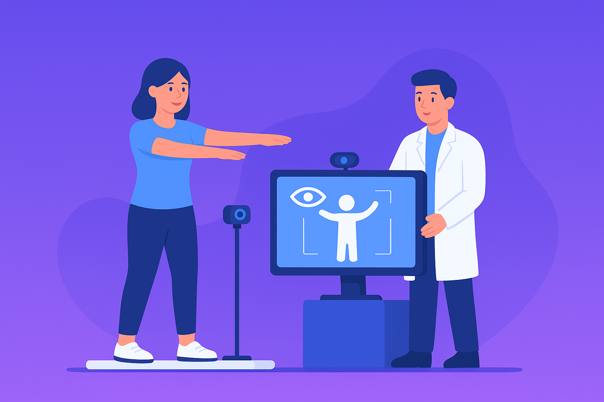

# 🏥 RehabSystem - Sistema Avanzado de Rehabilitación

[](https://www.python.org/)
[](https://flask.palletsprojects.com/)
[](LICENSE)
[](tests/)

Sistema web completo para gestión de rehabilitación física con visión artificial, diseñado para administradores, terapeutas y pacientes.



## ✨ Características Principales

### 🎯 Módulos Implementados

- **👨‍💼 Panel de Administrador**
  - Dashboard con estadísticas en tiempo real
  - Gestión completa de usuarios, terapeutas y pacientes
  - Sistema de configuración con 6 módulos
  - Exportación de datos en CSV
  - Acciones rápidas interactivas (Nuevo usuario, Backup, Logs, Notificaciones)
  - Gráficas de actividad con Chart.js

- **🧑‍⚕️ Panel de Terapeuta**
  - Dashboard con métricas de pacientes
  - Creador de rutinas inteligente con IA
  - Gestión de sesiones y citas
  - Biblioteca de 8 ejercicios predefinidos
  - Estadísticas en tiempo real
  - **📹 Módulo de Cámara en Tiempo Real** (NUEVO)
    - Captura de video en vivo
    - Monitoreo de sesiones de pacientes
    - Captura de instantáneas
    - Métricas en tiempo real

- **🤕 Panel de Paciente**
  - Dashboard personalizado con progreso
  - Historial de sesiones
  - Lista de terapeutas asignados
  - Inicio de terapia guiada
  - Sistema de mensajería

### 🎨 Características de UI/UX

- ✅ **Modo Claro/Oscuro** - Cambio dinámico de tema
- ✅ **Traducción Bilingüe** - Español/Inglés (150+ traducciones)
- ✅ **Diseño Responsive** - Optimizado para móviles y tablets
- ✅ **Animaciones CSS** - Efectos visuales modernos
- ✅ **Notificaciones Toast** - Feedback visual inmediato

### 🔐 Seguridad

- Autenticación con Flask-Login
- Encriptación de contraseñas con Bcrypt
- Control de acceso basado en roles
- Sesiones seguras
- Protección CSRF

## 🚀 Instalación

### Requisitos Previos

- Python 3.10 o superior
- pip (gestor de paquetes de Python)
- Git

### Pasos de Instalación

1. **Clonar el repositorio**
```bash
git clone https://github.com/tu-usuario/rehab-system.git
cd rehab-system/web-RehabSystem
```

2. **Crear entorno virtual**
```bash
python -m venv .venv
```

3. **Activar entorno virtual**
```bash
# Windows
.venv\Scripts\activate

# Linux/Mac
source .venv/bin/activate
```

4. **Instalar dependencias**
```bash
pip install -r requirements.txt
```

5. **Configurar variables de entorno**
```bash
# Copiar archivo de ejemplo
cp .env.txt .env

# Editar .env con tus configuraciones
```

6. **Inicializar base de datos**
```bash
python seed_data.py
```

7. **Ejecutar aplicación**
```bash
python run.py
```

8. **Acceder a la aplicación**
```
http://127.0.0.1:5000
```

## 🧪 Testing

Ejecutar suite de pruebas completa:

```bash
pytest tests/ -v
```

Ejecutar con cobertura:

```bash
pytest tests/ --cov=app --cov-report=html
```

**Estado actual:** ✅ 10/10 tests pasando (100%)

## 📁 Estructura del Proyecto

```
web-RehabSystem/
├── app/
│   ├── __init__.py          # Inicialización de Flask
│   ├── config.py            # Configuración
│   ├── models.py            # Modelos SQLAlchemy
│   ├── routes.py            # Rutas de la aplicación
│   └── forms.py             # Formularios WTForms
├── static/
│   ├── css/
│   │   ├── dashboard.css    # Estilos principales
│   │   └── themes.css       # Sistema de temas
│   ├── js/
│   │   ├── theme-manager.js # Gestor de temas
│   │   └── routine-builder.js # Constructor de rutinas
│   └── images/
├── templates/
│   ├── admin/               # Vistas de administrador
│   ├── therapist/           # Vistas de terapeuta
│   ├── patient/             # Vistas de paciente
│   ├── index.html           # Landing page
│   └── login.html           # Página de login
├── tests/                   # Suite de pruebas
├── instance/
│   └── rehab.db            # Base de datos SQLite
├── run.py                  # Punto de entrada
├── requirements.txt        # Dependencias
└── README.md              # Este archivo
```

## 🔑 Credenciales de Prueba

Para acceder al sistema en modo desarrollo:

| Rol | Usuario | Contraseña |
|-----|---------|------------|
| Administrador | `admin` | `admin123` |
| Terapeuta | `terapeuta` | `tera123` |
| Paciente | `paciente` | `paci123` |

⚠️ **Importante:** Cambiar estas credenciales en producción.

## 🛠️ Tecnologías Utilizadas

### Backend
- **Flask 3.1.2** - Framework web
- **SQLAlchemy 2.0** - ORM
- **Flask-Login** - Autenticación
- **Flask-Bcrypt** - Encriptación
- **Flask-Migrate** - Migraciones de BD
- **Pytest** - Testing

### Frontend
- **Bootstrap 5.3** - Framework CSS
- **Font Awesome 6.4** - Iconos
- **Chart.js** - Gráficas
- **JavaScript ES6+** - Interactividad

### Base de Datos
- **SQLite** (desarrollo)

## 📊 Modelos de Base de Datos

- **User** - Usuarios del sistema
- **Patient** - Pacientes con progreso
- **Therapist** - Terapeutas con especialidades
- **Exercise** - Catálogo de ejercicios
- **Appointment** - Citas programadas
- **SystemSettings** - Configuración persistente

## 🎯 Roadmap

### Próximas Funcionalidades

- [ ] Módulo de Visión Artificial (detección de movimientos)
- [ ] Reportes avanzados con gráficas
- [ ] Sistema de mensajería en tiempo real
- [ ] Videollamadas integradas
- [ ] App móvil (React Native)
- [ ] API REST completa
- [ ] Integración con dispositivos wearables

## 📝 Documentación Adicional

- [Guía de Configuración](SETTINGS_GUIDE.md)
- [Sistema de Traducción](LANGUAGE_GUIDE.md)
- [Características del Admin](ADMIN_FEATURES.md)
- [Changelog](CHANGELOG.md)

## 🤝 Contribuir

Las contribuciones son bienvenidas! Por favor:

1. Fork el proyecto
2. Crea una rama para tu feature (`git checkout -b feature/AmazingFeature`)
3. Commit tus cambios (`git commit -m 'Add some AmazingFeature'`)
4. Push a la rama (`git push origin feature/AmazingFeature`)
5. Abre un Pull Request

## 📄 Licencia

Este proyecto está bajo la Licencia MIT. Ver el archivo `LICENSE` para más detalles.

## 👨‍💻 Autor

**Kunin Denis** - Desarrollador Principal

## 🙏 Agradecimientos

- Bootstrap por el framework CSS
- Font Awesome por los iconos
- Chart.js por las gráficas
- Flask por el framework web

## 📞 Soporte

Para preguntas o problemas:
- Abrir un [Issue](https://github.com/tu-usuario/rehab-system/issues)
- Revisar la [Documentación](docs/)
- Ejecutar tests: `pytest tests/ -v`

---

**Última actualización:** Diciembre 2024  
**Versión:** 2.0.0  
**Estado:** ✅ Producción Ready

⭐ Si te gusta este proyecto, dale una estrella en GitHub!
