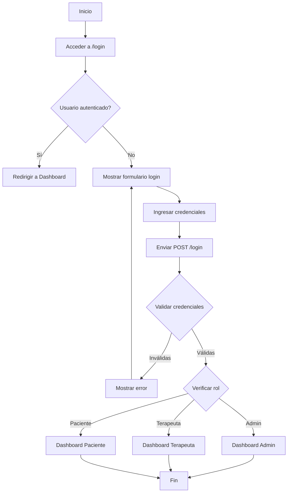
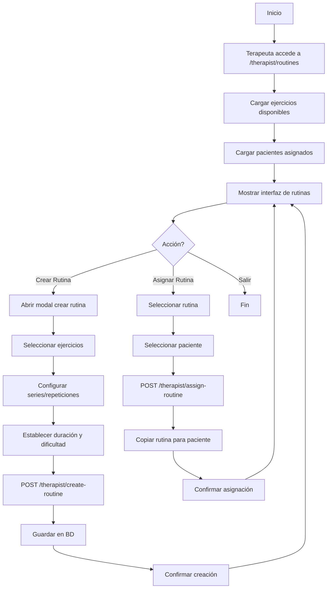
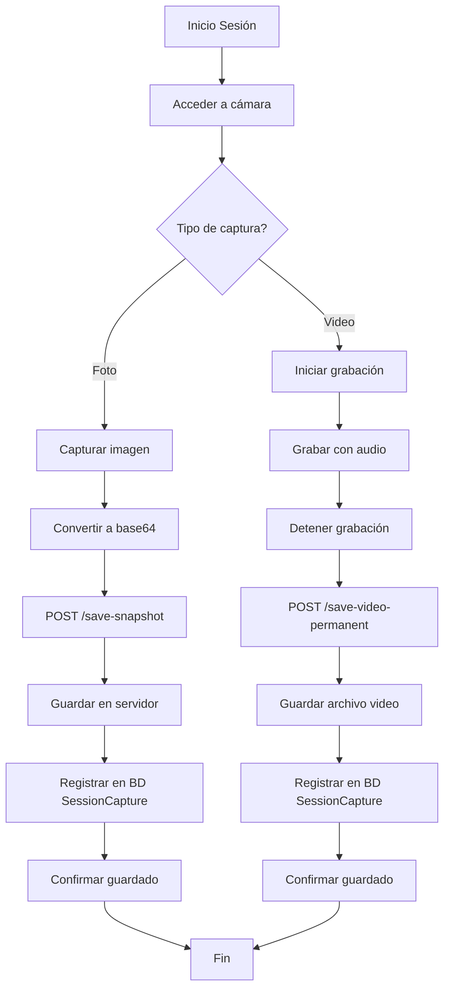

# 📊 DIAGRAMAS COMPLETOS - Sistema de Rehabilitación

## Índice de Diagramas

1. [Diagrama de Actividad](#1-diagrama-de-actividad)   LISTO
2. [Diagrama de Colaboración](#2-diagrama-de-colaboración) LISTO
3. [Diagrama de Componente](#3-diagrama-de-componente)  LISTO
4. [Diagrama de Clases](#4-diagrama-de-clases) LISTO
5. [Diagrama de Navegación](#5-diagrama-de-navegación)  LISTO
6. [Diagrama de Entidad Relación](#6-diagrama-de-entidad-relación) LISTO
7. [Diagrama de Estructura de Datos](#7-diagrama-de-estructura-de-datos) LISTO
8. [Diagrama de Arquitectura de la Aplicación](#8-diagrama-de-arquitectura-de-la-aplicación) LISTO

---

## 1. DIAGRAMA DE ACTIVIDAD

### Flujo de Autenticación y Acceso al Sistema



### Flujo de Creación y Asignación de Rutina (Terapeuta)




### Flujo de Captura de Video/Foto en Sesión (Terapeuta/Paciente)



---

## 2. DIAGRAMA DE COLABORACIÓN

### Interacción entre Objetos en Autenticación

```
┌─────────────┐
│   Usuario   │
└──────┬──────┘
       │ 1: POST /login(usuario, password)
       ▼
┌─────────────┐
│ Flask Route │
│   login()   │
└──────┬──────┘
       │ 2: query(username)
       ▼
┌─────────────┐
│  User Model │
└──────┬──────┘
       │ 3: check_password(password)
       ▼
┌─────────────┐
│   Bcrypt    │
└──────┬──────┘
       │ 4: verify_hash()
       │
       │ 5: login_user(user)
       ▼
┌─────────────┐
│ Flask-Login │
└──────┬──────┘
       │ 6: create_session()
       │
       │ 7: redirect(dashboard)
       ▼
┌─────────────┐
│  Dashboard  │
└─────────────┘
```

### Interacción en Creación de Rutina

```
┌──────────────┐
│  Terapeuta   │
└──────┬───────┘
       │ 1: POST /therapist/create-routine(datos)
       ▼
┌──────────────┐
│ Flask Routes │
│create_routine│
└──────┬───────┘
       │ 2: query(id_usuario)
       ▼
┌──────────────┐
│  Therapist   │
│    Model     │
└──────┬───────┘
       │ 3: create(Routine)
       ▼
┌──────────────┐
│   Routine    │
│    Model     │
└──────┬───────┘
       │ 4: flush() → routine_id
       │
       │ 5: create(RoutineExercise) [loop]
       ▼
┌──────────────┐
│RoutineExer   │
│  cise Model  │
└──────┬───────┘
       │ 6: commit()
       ▼
┌──────────────┐
│   Database   │
└──────────────┘
```


---

## 3. DIAGRAMA DE COMPONENTE

### Arquitectura de Módulos del Sistema

```
┌─────────────────────────────────────────────────────────────┐
│                    SISTEMA REHAB                            │
│                                                             │
│  ┌──────────────────────────────────────────────────────┐  │
│  │              CAPA DE PRESENTACIÓN                    │  │
│  │                                                       │  │
│  │  ┌──────────────┐  ┌──────────────┐  ┌────────────┐ │  │
│  │  │  Templates   │  │   Static     │  │   Forms    │ │  │
│  │  │   (Jinja2)   │  │  (CSS/JS)    │  │ (WTForms)  │ │  │
│  │  └──────────────┘  └──────────────┘  └────────────┘ │  │
│  └──────────────────────────────────────────────────────┘  │
│                           │                                 │
│  ┌──────────────────────────────────────────────────────┐  │
│  │              CAPA DE APLICACIÓN                      │  │
│  │                                                       │  │
│  │  ┌──────────────┐  ┌──────────────┐  ┌────────────┐ │  │
│  │  │   Routes     │  │    Config    │  │   __init__ │ │  │
│  │  │  (Flask)     │  │              │  │  (Factory) │ │  │
│  │  └──────────────┘  └──────────────┘  └────────────┘ │  │
│  │                                                       │  │
│  │  ┌──────────────┐  ┌──────────────┐                 │  │
│  │  │ Decoradores  │  │  Validadores │                 │  │
│  │  │ (@role_req)  │  │              │                 │  │
│  │  └──────────────┘  └──────────────┘                 │  │
│  └──────────────────────────────────────────────────────┘  │
│                           │                                 │
│  ┌──────────────────────────────────────────────────────┐  │
│  │              CAPA DE NEGOCIO                         │  │
│  │                                                       │  │
│  │  ┌──────────────┐  ┌──────────────┐  ┌────────────┐ │  │
│  │  │   Models     │  │  Bcrypt      │  │Flask-Login │ │  │
│  │  │ (SQLAlchemy) │  │  (Hash)      │  │  (Auth)    │ │  │
│  │  └──────────────┘  └──────────────┘  └────────────┘ │  │
│  └──────────────────────────────────────────────────────┘  │
│                           │                                 │
│  ┌──────────────────────────────────────────────────────┐  │
│  │              CAPA DE DATOS                           │  │
│  │                                                       │  │
│  │  ┌──────────────┐  ┌──────────────┐  ┌────────────┐ │  │
│  │  │  PostgreSQL  │  │  SQLAlchemy  │  │   Alembic  │ │  │
│  │  │  (Database)  │  │    (ORM)     │  │(Migrations)│ │  │
│  │  └──────────────┘  └──────────────┘  └────────────┘ │  │
│  └──────────────────────────────────────────────────────┘  │
│                                                             │
│  ┌──────────────────────────────────────────────────────┐  │
│  │           COMPONENTES EXTERNOS                       │  │
│  │                                                       │  │
│  │  ┌──────────────┐  ┌──────────────┐  ┌────────────┐ │  │
│  │  │   Render     │  │   Gunicorn   │  │   Nginx    │ │  │
│  │  │  (Deploy)    │  │   (WSGI)     │  │  (Proxy)   │ │  │
│  │  └──────────────┘  └──────────────┘  └────────────┘ │  │
│  └──────────────────────────────────────────────────────┘  │
└─────────────────────────────────────────────────────────────┘
```

### Módulos Principales

```
app/
├── __init__.py          [Factory Pattern - Inicialización]
├── config.py            [Configuración - Variables de entorno]
├── models.py            [Modelos de datos - ORM]
├── routes.py            [Controladores - Endpoints]
├── forms.py             [Formularios - Validación]
│
templates/               [Vistas - HTML]
├── admin/
├── terapeuta/
├── paciente/
└── base.html
│
static/                  [Recursos estáticos]
├── css/
├── js/
└── uploads/
    ├── photos/
    ├── videos/
    └── videos_permanentes/
```


---

## 4. DIAGRAMA DE CLASES

### Modelo de Datos Completo

```
┌─────────────────────────────────────┐
│            User                     │
├─────────────────────────────────────┤
│ - id: Integer (PK)                  │
│ - nombre_usuario: String(80)        │
│ - correo_electronico: String(120)   │
│ - contrasena_encriptada: String(128)│
│ - rol: String(20)                   │
│ - esta_activo: Boolean              │
│ - fecha_creacion: DateTime          │
├─────────────────────────────────────┤
│ + set_password(password)            │
│ + check_password(password): Boolean │
└─────────────────────────────────────┘
         │                    │
         │ 1:1                │ 1:1
         ▼                    ▼
┌──────────────────┐   ┌──────────────────┐
│    Patient       │   │    Therapist     │
├──────────────────┤   ├──────────────────┤
│ - id: Integer(PK)│   │ - id: Integer(PK)│
│ - id_usuario: FK │   │ - id_usuario: FK │
│ - nombre_completo│   │ - nombre_completo│
│ - diagnostico    │   │ - especialidad   │
│ - progreso: Float│   │ - total_pacientes│
│ - sesiones_total │   │ - fecha_creacion │
│ - sesiones_comp  │   └──────────────────┘
│ - fecha_creacion │            │
└──────────────────┘            │
         │                      │
         │ 1:N                  │ 1:N
         ▼                      ▼
┌──────────────────┐   ┌──────────────────┐
│    Routine       │   │    Routine       │
├──────────────────┤   ├──────────────────┤
│ - id: Integer(PK)│   │ (mismo modelo)   │
│ - nombre: String │   └──────────────────┘
│ - descripcion    │            │
│ - id_terapeuta:FK│            │
│ - id_paciente:FK │            │ 1:N
│ - duracion_min   │            ▼
│ - dificultad     │   ┌──────────────────┐
│ - esta_activa    │   │ SessionCapture   │
│ - fecha_creacion │   ├──────────────────┤
└──────────────────┘   │ - id: Integer(PK)│
         │             │ - id_terapeuta:FK│
         │ 1:N         │ - id_paciente: FK│
         ▼             │ - tipo_captura   │
┌──────────────────┐   │ - nombre_archivo │
│ RoutineExercise  │   │ - ruta_archivo   │
├──────────────────┤   │ - tamano_archivo │
│ - id: Integer(PK)│   │ - duracion       │
│ - id_rutina: FK  │   │ - notas          │
│ - id_ejercicio:FK│   │ - fecha_sesion   │
│ - orden: Integer │   │ - es_permanente  │
│ - series: Integer│   │ - contiene_audio │
│ - repeticiones   │   └──────────────────┘
│ - segundos_desc  │            │
│ - notas          │            │ 1:N
└──────────────────┘            ▼
         │             ┌──────────────────┐
         │ N:1         │   VideoShare     │
         ▼             ├──────────────────┤
┌──────────────────┐   │ - id: Integer(PK)│
│    Exercise      │   │ - id_captura: FK │
├──────────────────┤   │ - id_terapeuta:FK│
│ - id: Integer(PK)│   │ - id_paciente: FK│
│ - nombre: String │   │ - mensaje: Text  │
│ - descripcion    │   │ - leido: Boolean │
│ - categoria      │   │ - fecha_compartid│
│ - repeticiones   │   │ - fecha_leido    │
│ - fecha_creacion │   └──────────────────┘
└──────────────────┘

┌──────────────────┐   ┌──────────────────┐
│   Appointment    │   │ SystemSettings   │
├──────────────────┤   ├──────────────────┤
│ - id: Integer(PK)│   │ - id: Integer(PK)│
│ - id_paciente:FK │   │ - clave: String  │
│ - id_terapeuta:FK│   │ - valor: String  │
│ - fecha: DateTime│   │ - fecha_actual   │
│ - estado: String │   ├──────────────────┤
│ - fecha_creacion │   │ + get_setting()  │
└──────────────────┘   │ + set_setting()  │
                       └──────────────────┘
```

### Relaciones entre Clases

```
User 1──────1 Patient
User 1──────1 Therapist

Therapist 1──────N Routine (creadas)
Patient 1──────N Routine (asignadas)

Routine 1──────N RoutineExercise
Exercise 1──────N RoutineExercise

Therapist 1──────N SessionCapture
Patient 1──────N SessionCapture

SessionCapture 1──────N VideoShare
Therapist 1──────N VideoShare
Patient 1──────N VideoShare

Patient N──────N Therapist (via Appointment)
```


---

## 5. DIAGRAMA DE NAVEGACIÓN

### Flujo de Navegación por Rol

```
                    ┌──────────────┐
                    │    /login    │
                    └──────┬───────┘
                           │
                    ┌──────▼───────┐
                    │ Autenticación│
                    └──────┬───────┘
                           │
        ┌──────────────────┼──────────────────┐
        │                  │                  │
   ┌────▼────┐       ┌────▼────┐       ┌────▼────┐
   │  ADMIN  │       │TERAPEUTA│       │PACIENTE │
   └────┬────┘       └────┬────┘       └────┬────┘
        │                 │                  │
        │                 │                  │
```

### Navegación del Administrador

```
/admin/dashboard (Inicio)
    │
    ├─► /admin/users (Gestión de usuarios)
    │       └─► Modal: Agregar/Editar usuario
    │
    ├─► /admin/therapists (Gestión de terapeutas)
    │       ├─► Modal: Agregar terapeuta
    │       └─► Ver detalles de terapeuta
    │
    ├─► /admin/patients (Gestión de pacientes)
    │       ├─► Modal: Agregar paciente
    │       └─► Ver detalles de paciente
    │
    ├─► /admin/settings (Configuración del sistema)
    │       ├─► Duración de sesiones
    │       ├─► Notificaciones
    │       ├─► Respaldos
    │       ├─► Seguridad
    │       ├─► Visión artificial
    │       └─► Apariencia
    │
    ├─► /admin/export-data (Exportar datos)
    │       ├─► /admin/export/users
    │       ├─► /admin/export/patients
    │       ├─► /admin/export/therapists
    │       ├─► /admin/export/exercises
    │       └─► /admin/export/all
    │
    └─► /logout (Cerrar sesión)
```

### Navegación del Terapeuta

```
/therapist/dashboard (Inicio)
    │
    ├─► /therapist/patients (Mis pacientes)
    │       └─► Ver detalles de paciente
    │
    ├─► /therapist/routines (Rutinas)
    │       ├─► POST /therapist/create-routine
    │       ├─► POST /therapist/assign-routine
    │       └─► Ver/Editar rutina
    │
    ├─► /therapist/start-session (Iniciar sesión)
    │       ├─► Capturar foto
    │       ├─► Grabar video
    │       └─► Guardar sesión
    │
    ├─► /therapist/video-gallery (Galería de videos)
    │       ├─► Ver capturas
    │       ├─► Reproducir videos
    │       └─► Compartir con paciente
    │
    ├─► /therapist/appointments (Citas)
    │       ├─► Ver calendario
    │       └─► Gestionar citas
    │
    └─► /logout (Cerrar sesión)
```

### Navegación del Paciente

```
/patient/dashboard (Inicio)
    │
    ├─► /patient/routines (Mis rutinas)
    │       ├─► Ver rutinas asignadas
    │       └─► Ver detalles de rutina
    │
    ├─► /patient/start-therapy (Iniciar terapia)
    │       ├─► Seleccionar rutina
    │       ├─► Realizar ejercicios
    │       ├─► Capturar foto
    │       └─► Grabar video
    │
    ├─► /patient/video-gallery (Galería de videos)
    │       ├─► Ver mis capturas
    │       ├─► Ver videos del terapeuta
    │       └─► Compartir con terapeuta
    │
    ├─► /patient/history (Historial)
    │       └─► Ver sesiones completadas
    │
    ├─► /patient/therapists (Mis terapeutas)
    │       └─► Ver información de terapeutas
    │
    ├─► /patient/messages (Mensajes)
    │       ├─► Ver mensajes recibidos
    │       └─► Enviar mensajes
    │
    ├─► /patient/profile (Perfil)
    │       └─► Ver/Editar información personal
    │
    ├─► /patient/settings (Configuración)
    │       ├─► Cambiar contraseña
    │       └─► Preferencias
    │
    └─► /logout (Cerrar sesión)
```

### Mapa de Rutas Completo

```
/                           → index.html
/login                      → login.html
/logout                     → Cerrar sesión

/admin/dashboard            → admin/dashboard.html
/admin/users                → admin/users.html
/admin/therapists           → admin/therapists.html
/admin/patients             → admin/patients.html
/admin/settings             → admin/settings.html
/admin/export-data          → admin/export_data.html
/admin/add-therapist        → POST (crear terapeuta)
/admin/add-patient          → POST (crear paciente)
/admin/export/<type>        → Descargar CSV

/therapist/dashboard        → terapeuta/dashboard.html
/therapist/patients         → terapeuta/patients.html
/therapist/routines         → terapeuta/routines.html
/therapist/start-session    → terapeuta/start_session.html
/therapist/video-gallery    → terapeuta/video_gallery.html
/therapist/appointments     → terapeuta/appointments.html
/therapist/create-routine   → POST (crear rutina)
/therapist/assign-routine   → POST (asignar rutina)

/patient/dashboard          → paciente/dashboard.html
/patient/routines           → paciente/routines.html
/patient/start-therapy      → paciente/start_therapy.html
/patient/video-gallery      → paciente/video_gallery.html
/patient/history            → paciente/history.html
/patient/therapists         → paciente/therapists.html
/patient/messages           → paciente/messages.html
/patient/profile            → paciente/profile.html
/patient/settings           → paciente/settings.html
```


---

## 6. DIAGRAMA DE ENTIDAD RELACIÓN

### Modelo Entidad-Relación Completo

```
┌─────────────────────────────────────────────────────────────────┐
│                     BASE DE DATOS REHAB                         │
└─────────────────────────────────────────────────────────────────┘

┌──────────────────┐
│      USER        │
├──────────────────┤
│ PK id            │
│    nombre_usuario│◄────────────┐
│    correo_electr │             │
│    contrasena_enc│             │ 1:1
│    rol           │             │
│    esta_activo   │             │
│    fecha_creacion│             │
└──────────────────┘             │
         │                       │
         │ 1:1                   │
         ▼                       │
┌──────────────────┐    ┌──────────────────┐
│     PATIENT      │    │    THERAPIST     │
├──────────────────┤    ├──────────────────┤
│ PK id            │    │ PK id            │
│ FK id_usuario    │────┘ FK id_usuario    │
│    nombre_completo    │    nombre_completo
│    diagnostico   │    │    especialidad  │
│    progreso      │    │    total_pacientes
│    sesiones_total│    │    fecha_creacion│
│    sesiones_comp │    └──────────────────┘
│    fecha_creacion│             │
└──────────────────┘             │
         │                       │
         │                       │
         │ N                     │ N
         │                       │
         │    ┌──────────────────┴──────────────────┐
         │    │                                      │
         │    ▼                                      ▼
         │ ┌──────────────────┐          ┌──────────────────┐
         │ │     ROUTINE      │          │ SESSION_CAPTURE  │
         │ ├──────────────────┤          ├──────────────────┤
         │ │ PK id            │          │ PK id            │
         └►│ FK id_paciente   │          │ FK id_terapeuta  │
           │ FK id_terapeuta  │◄─────────│ FK id_paciente   │
           │    nombre        │          │    tipo_captura  │
           │    descripcion   │          │    nombre_archivo│
           │    duracion_min  │          │    ruta_archivo  │
           │    dificultad    │          │    tamano_archivo│
           │    esta_activa   │          │    duracion      │
           │    fecha_creacion│          │    notas         │
           └──────────────────┘          │    fecha_sesion  │
                  │                      │    es_permanente │
                  │ 1:N                  │    contiene_audio│
                  ▼                      └──────────────────┘
           ┌──────────────────┐                   │
           │ ROUTINE_EXERCISE │                   │ 1:N
           ├──────────────────┤                   ▼
           │ PK id            │          ┌──────────────────┐
           │ FK id_rutina     │          │   VIDEO_SHARE    │
           │ FK id_ejercicio  │          ├──────────────────┤
           │    orden         │          │ PK id            │
           │    series        │          │ FK id_captura    │
           │    repeticiones  │          │ FK id_terapeuta  │
           │    segundos_desc │          │ FK id_paciente   │
           │    notas         │          │    mensaje       │
           └──────────────────┘          │    leido         │
                  │                      │    fecha_compartid
                  │ N:1                  │    fecha_leido   │
                  ▼                      └──────────────────┘
           ┌──────────────────┐
           │    EXERCISE      │
           ├──────────────────┤
           │ PK id            │
           │    nombre        │
           │    descripcion   │
           │    categoria     │
           │    repeticiones  │
           │    fecha_creacion│
           └──────────────────┘

┌──────────────────┐          ┌──────────────────┐
│   APPOINTMENT    │          │ SYSTEM_SETTINGS  │
├──────────────────┤          ├──────────────────┤
│ PK id            │          │ PK id            │
│ FK id_paciente   │          │    clave (UNIQUE)│
│ FK id_terapeuta  │          │    valor         │
│    fecha         │          │    fecha_actual  │
│    estado        │          └──────────────────┘
│    fecha_creacion│
└──────────────────┘
```

### Cardinalidades

```
User ──────1:1────── Patient
User ──────1:1────── Therapist

Therapist ──1:N──── Routine (como creador)
Patient ────1:N──── Routine (como asignado)

Routine ────1:N──── RoutineExercise
Exercise ───1:N──── RoutineExercise

Therapist ──1:N──── SessionCapture
Patient ────1:N──── SessionCapture

SessionCapture ─1:N─ VideoShare
Therapist ──────1:N─ VideoShare
Patient ────────1:N─ VideoShare

Patient ────N:M──── Therapist (via Appointment)
```

### Claves Foráneas

```
Patient.id_usuario → User.id
Therapist.id_usuario → User.id

Routine.id_paciente → Patient.id
Routine.id_terapeuta → Therapist.id

RoutineExercise.id_rutina → Routine.id
RoutineExercise.id_ejercicio → Exercise.id

SessionCapture.id_terapeuta → Therapist.id
SessionCapture.id_paciente → Patient.id

VideoShare.id_captura → SessionCapture.id
VideoShare.id_terapeuta → Therapist.id
VideoShare.id_paciente → Patient.id

Appointment.id_paciente → Patient.id
Appointment.id_terapeuta → Therapist.id
```


---

## 7. DIAGRAMA DE ESTRUCTURA DE DATOS

### Modelo de Datos Detallado con Tipos

```
┌─────────────────────────────────────────────────────────┐
│                        USER                             │
├─────────────────────────────────────────────────────────┤
│ id                    : INTEGER (PRIMARY KEY)           │
│ nombre_usuario        : VARCHAR(80) UNIQUE NOT NULL     │
│ correo_electronico    : VARCHAR(120) UNIQUE NOT NULL    │
│ contrasena_encriptada : VARCHAR(128) NOT NULL           │
│ rol                   : VARCHAR(20) NOT NULL            │
│                         CHECK IN ('admin', 'therapist', │
│                                    'patient')           │
│ esta_activo           : BOOLEAN DEFAULT TRUE            │
│ fecha_creacion        : TIMESTAMP DEFAULT NOW()         │
├─────────────────────────────────────────────────────────┤
│ INDEXES:                                                │
│   - idx_user_username (nombre_usuario)                  │
│   - idx_user_email (correo_electronico)                 │
│   - idx_user_rol (rol)                                  │
└─────────────────────────────────────────────────────────┘

┌─────────────────────────────────────────────────────────┐
│                       PATIENT                           │
├─────────────────────────────────────────────────────────┤
│ id                    : INTEGER (PRIMARY KEY)           │
│ id_usuario            : INTEGER (FOREIGN KEY → User.id) │
│                         UNIQUE                          │
│ nombre_completo       : VARCHAR(200) NOT NULL           │
│ diagnostico           : TEXT                            │
│ progreso              : FLOAT DEFAULT 0.0               │
│                         CHECK (progreso >= 0 AND        │
│                                progreso <= 100)         │
│ sesiones_totales      : INTEGER DEFAULT 0               │
│ sesiones_completadas  : INTEGER DEFAULT 0               │
│ fecha_creacion        : TIMESTAMP DEFAULT NOW()         │
├─────────────────────────────────────────────────────────┤
│ INDEXES:                                                │
│   - idx_patient_user (id_usuario)                       │
│   - idx_patient_progreso (progreso)                     │
└─────────────────────────────────────────────────────────┘

┌─────────────────────────────────────────────────────────┐
│                      THERAPIST                          │
├─────────────────────────────────────────────────────────┤
│ id                    : INTEGER (PRIMARY KEY)           │
│ id_usuario            : INTEGER (FOREIGN KEY → User.id) │
│                         UNIQUE                          │
│ nombre_completo       : VARCHAR(200) NOT NULL           │
│ especialidad          : VARCHAR(100)                    │
│ total_pacientes       : INTEGER DEFAULT 0               │
│ fecha_creacion        : TIMESTAMP DEFAULT NOW()         │
├─────────────────────────────────────────────────────────┤
│ INDEXES:                                                │
│   - idx_therapist_user (id_usuario)                     │
│   - idx_therapist_especialidad (especialidad)           │
└─────────────────────────────────────────────────────────┘

┌─────────────────────────────────────────────────────────┐
│                       ROUTINE                           │
├─────────────────────────────────────────────────────────┤
│ id                    : INTEGER (PRIMARY KEY)           │
│ nombre                : VARCHAR(200) NOT NULL           │
│ descripcion           : TEXT                            │
│ id_terapeuta          : INTEGER (FK → Therapist.id)    │
│                         NOT NULL                        │
│ id_paciente           : INTEGER (FK → Patient.id)       │
│                         NULLABLE (NULL = template)      │
│ duracion_minutos      : INTEGER DEFAULT 30              │
│ dificultad            : VARCHAR(20) DEFAULT 'media'     │
│                         CHECK IN ('facil', 'media',     │
│                                    'dificil')           │
│ esta_activa           : BOOLEAN DEFAULT TRUE            │
│ fecha_creacion        : TIMESTAMP DEFAULT NOW()         │
├─────────────────────────────────────────────────────────┤
│ INDEXES:                                                │
│   - idx_routine_therapist (id_terapeuta)                │
│   - idx_routine_patient (id_paciente)                   │
│   - idx_routine_active (esta_activa)                    │
└─────────────────────────────────────────────────────────┘

┌─────────────────────────────────────────────────────────┐
│                   ROUTINE_EXERCISE                      │
├─────────────────────────────────────────────────────────┤
│ id                    : INTEGER (PRIMARY KEY)           │
│ id_rutina             : INTEGER (FK → Routine.id)       │
│                         NOT NULL, ON DELETE CASCADE     │
│ id_ejercicio          : INTEGER (FK → Exercise.id)      │
│                         NOT NULL                        │
│ orden                 : INTEGER DEFAULT 0               │
│ series                : INTEGER DEFAULT 3               │
│ repeticiones          : INTEGER DEFAULT 10              │
│ segundos_descanso     : INTEGER DEFAULT 30              │
│ notas                 : TEXT                            │
├─────────────────────────────────────────────────────────┤
│ INDEXES:                                                │
│   - idx_routine_exercise_routine (id_rutina)            │
│   - idx_routine_exercise_exercise (id_ejercicio)        │
│   - idx_routine_exercise_orden (orden)                  │
└─────────────────────────────────────────────────────────┘

┌─────────────────────────────────────────────────────────┐
│                      EXERCISE                           │
├─────────────────────────────────────────────────────────┤
│ id                    : INTEGER (PRIMARY KEY)           │
│ nombre                : VARCHAR(200) NOT NULL           │
│ descripcion           : TEXT                            │
│ categoria             : VARCHAR(50)                     │
│ repeticiones          : VARCHAR(50)                     │
│ fecha_creacion        : TIMESTAMP DEFAULT NOW()         │
├─────────────────────────────────────────────────────────┤
│ INDEXES:                                                │
│   - idx_exercise_categoria (categoria)                  │
│   - idx_exercise_nombre (nombre)                        │
└─────────────────────────────────────────────────────────┘

┌─────────────────────────────────────────────────────────┐
│                   SESSION_CAPTURE                       │
├─────────────────────────────────────────────────────────┤
│ id                    : INTEGER (PRIMARY KEY)           │
│ id_terapeuta          : INTEGER (FK → Therapist.id)    │
│                         NULLABLE                        │
│ id_paciente           : INTEGER (FK → Patient.id)       │
│                         NULLABLE                        │
│ tipo_captura          : VARCHAR(20) NOT NULL            │
│                         CHECK IN ('photo', 'video')     │
│ nombre_archivo        : VARCHAR(255) NOT NULL           │
│ ruta_archivo          : VARCHAR(500) NOT NULL           │
│ tamano_archivo        : INTEGER (bytes)                 │
│ duracion              : INTEGER (segundos, solo video)  │
│ notas                 : TEXT                            │
│ fecha_sesion          : TIMESTAMP DEFAULT NOW()         │
│ fecha_creacion        : TIMESTAMP DEFAULT NOW()         │
│ es_permanente         : BOOLEAN DEFAULT FALSE           │
│ contiene_audio        : BOOLEAN DEFAULT FALSE           │
├─────────────────────────────────────────────────────────┤
│ INDEXES:                                                │
│   - idx_capture_therapist (id_terapeuta)                │
│   - idx_capture_patient (id_paciente)                   │
│   - idx_capture_tipo (tipo_captura)                     │
│   - idx_capture_fecha (fecha_sesion)                    │
└─────────────────────────────────────────────────────────┘

┌─────────────────────────────────────────────────────────┐
│                     VIDEO_SHARE                         │
├─────────────────────────────────────────────────────────┤
│ id                    : INTEGER (PRIMARY KEY)           │
│ id_captura            : INTEGER (FK → SessionCapture.id)│
│                         NOT NULL                        │
│ id_terapeuta          : INTEGER (FK → Therapist.id)    │
│                         NOT NULL                        │
│ id_paciente           : INTEGER (FK → Patient.id)       │
│                         NOT NULL                        │
│ mensaje               : TEXT                            │
│ leido                 : BOOLEAN DEFAULT FALSE           │
│ fecha_compartido      : TIMESTAMP DEFAULT NOW()         │
│ fecha_leido           : TIMESTAMP NULLABLE              │
├─────────────────────────────────────────────────────────┤
│ INDEXES:                                                │
│   - idx_videoshare_capture (id_captura)                 │
│   - idx_videoshare_therapist (id_terapeuta)             │
│   - idx_videoshare_patient (id_paciente)                │
│   - idx_videoshare_leido (leido)                        │
└─────────────────────────────────────────────────────────┘

┌─────────────────────────────────────────────────────────┐
│                     APPOINTMENT                         │
├─────────────────────────────────────────────────────────┤
│ id                    : INTEGER (PRIMARY KEY)           │
│ id_paciente           : INTEGER (FK → Patient.id)       │
│ id_terapeuta          : INTEGER (FK → Therapist.id)    │
│ fecha                 : TIMESTAMP NOT NULL              │
│ estado                : VARCHAR(20) DEFAULT 'programada'│
│                         CHECK IN ('programada',         │
│                                    'completada',        │
│                                    'cancelada')         │
│ fecha_creacion        : TIMESTAMP DEFAULT NOW()         │
├─────────────────────────────────────────────────────────┤
│ INDEXES:                                                │
│   - idx_appointment_patient (id_paciente)               │
│   - idx_appointment_therapist (id_terapeuta)            │
│   - idx_appointment_fecha (fecha)                       │
│   - idx_appointment_estado (estado)                     │
└─────────────────────────────────────────────────────────┘

┌─────────────────────────────────────────────────────────┐
│                   SYSTEM_SETTINGS                       │
├─────────────────────────────────────────────────────────┤
│ id                    : INTEGER (PRIMARY KEY)           │
│ clave                 : VARCHAR(100) UNIQUE NOT NULL    │
│ valor                 : VARCHAR(500)                    │
│ fecha_actualizacion   : TIMESTAMP DEFAULT NOW()         │
│                         ON UPDATE NOW()                 │
├─────────────────────────────────────────────────────────┤
│ INDEXES:                                                │
│   - idx_settings_clave (clave)                          │
└─────────────────────────────────────────────────────────┘
```

### Restricciones de Integridad

```
CONSTRAINTS:
  - User.nombre_usuario: UNIQUE
  - User.correo_electronico: UNIQUE
  - Patient.id_usuario: UNIQUE, FK → User.id
  - Therapist.id_usuario: UNIQUE, FK → User.id
  - SystemSettings.clave: UNIQUE
  
CHECK CONSTRAINTS:
  - User.rol IN ('admin', 'therapist', 'patient')
  - Patient.progreso BETWEEN 0 AND 100
  - Routine.dificultad IN ('facil', 'media', 'dificil')
  - SessionCapture.tipo_captura IN ('photo', 'video')
  - Appointment.estado IN ('programada', 'completada', 'cancelada')

CASCADE DELETE:
  - RoutineExercise ON DELETE CASCADE (cuando se elimina Routine)
```


---

## 8. DIAGRAMA DE ARQUITECTURA DE LA APLICACIÓN

### Arquitectura General del Sistema

```
┌─────────────────────────────────────────────────────────────────┐
│                         INTERNET                                │
└────────────────────────────┬────────────────────────────────────┘
                             │
                             │ HTTPS
                             ▼
┌─────────────────────────────────────────────────────────────────┐
│                      RENDER.COM (PaaS)                          │
│                                                                 │
│  ┌───────────────────────────────────────────────────────────┐ │
│  │                    NGINX (Reverse Proxy)                  │ │
│  │  - SSL/TLS Termination                                    │ │
│  │  - Load Balancing                                         │ │
│  │  - Static Files Serving                                   │ │
│  └─────────────────────────┬─────────────────────────────────┘ │
│                            │                                    │
│                            ▼                                    │
│  ┌───────────────────────────────────────────────────────────┐ │
│  │              GUNICORN (WSGI Server)                       │ │
│  │  - Workers: 4                                             │ │
│  │  - Threads: 2                                             │ │
│  │  - Timeout: 120s                                          │ │
│  └─────────────────────────┬─────────────────────────────────┘ │
│                            │                                    │
│                            ▼                                    │
│  ┌───────────────────────────────────────────────────────────┐ │
│  │                  FLASK APPLICATION                        │ │
│  │                                                           │ │
│  │  ┌─────────────────────────────────────────────────────┐ │ │
│  │  │           PRESENTATION LAYER                        │ │ │
│  │  │                                                     │ │ │
│  │  │  ┌──────────────┐  ┌──────────────┐  ┌──────────┐ │ │ │
│  │  │  │  Templates   │  │   Static     │  │  Forms   │ │ │ │
│  │  │  │  (Jinja2)    │  │  (CSS/JS)    │  │(WTForms) │ │ │ │
│  │  │  └──────────────┘  └──────────────┘  └──────────┘ │ │ │
│  │  └─────────────────────────────────────────────────────┘ │ │
│  │                            │                              │ │
│  │  ┌─────────────────────────────────────────────────────┐ │ │
│  │  │           APPLICATION LAYER                         │ │ │
│  │  │                                                     │ │ │
│  │  │  ┌──────────────┐  ┌──────────────┐  ┌──────────┐ │ │ │
│  │  │  │   Routes     │  │   Config     │  │ __init__ │ │ │ │
│  │  │  │  (Flask)     │  │              │  │(Factory) │ │ │ │
│  │  │  └──────────────┘  └──────────────┘  └──────────┘ │ │ │
│  │  │                                                     │ │ │
│  │  │  ┌──────────────┐  ┌──────────────┐               │ │ │
│  │  │  │ @role_required│  │  Validators │               │ │ │
│  │  │  │  (Decorator) │  │              │               │ │ │
│  │  │  └──────────────┘  └──────────────┘               │ │ │
│  │  └─────────────────────────────────────────────────────┘ │ │
│  │                            │                              │ │
│  │  ┌─────────────────────────────────────────────────────┐ │ │
│  │  │            BUSINESS LAYER                           │ │ │
│  │  │                                                     │ │ │
│  │  │  ┌──────────────┐  ┌──────────────┐  ┌──────────┐ │ │ │
│  │  │  │   Models     │  │   Bcrypt     │  │Flask-    │ │ │ │
│  │  │  │(SQLAlchemy)  │  │   (Hash)     │  │Login     │ │ │ │
│  │  │  └──────────────┘  └──────────────┘  └──────────┘ │ │ │
│  │  └─────────────────────────────────────────────────────┘ │ │
│  │                            │                              │ │
│  │  ┌─────────────────────────────────────────────────────┐ │ │
│  │  │             DATA LAYER                              │ │ │
│  │  │                                                     │ │ │
│  │  │  ┌──────────────┐  ┌──────────────┐               │ │ │
│  │  │  │ SQLAlchemy   │  │   Alembic    │               │ │ │
│  │  │  │    (ORM)     │  │ (Migrations) │               │ │ │
│  │  │  └──────────────┘  └──────────────┘               │ │ │
│  │  └─────────────────────────────────────────────────────┘ │ │
│  └───────────────────────────────────────────────────────────┘ │
│                            │                                    │
│                            ▼                                    │
│  ┌───────────────────────────────────────────────────────────┐ │
│  │              FILE SYSTEM (Persistent Storage)             │ │
│  │                                                           │ │
│  │  static/uploads/                                          │ │
│  │    ├── photos/                                            │ │
│  │    ├── videos/                                            │ │
│  │    └── videos_permanentes/                                │ │
│  └───────────────────────────────────────────────────────────┘ │
└─────────────────────────────────────────────────────────────────┘
                             │
                             │ PostgreSQL Protocol
                             ▼
┌─────────────────────────────────────────────────────────────────┐
│              POSTGRESQL DATABASE (Render Managed)               │
│                                                                 │
│  ┌───────────────────────────────────────────────────────────┐ │
│  │  Tables:                                                  │ │
│  │    - user                                                 │ │
│  │    - patient                                              │ │
│  │    - therapist                                            │ │
│  │    - routine                                              │ │
│  │    - routine_exercise                                     │ │
│  │    - exercise                                             │ │
│  │    - session_capture                                      │ │
│  │    - video_share                                          │ │
│  │    - appointment                                          │ │
│  │    - system_settings                                      │ │
│  └───────────────────────────────────────────────────────────┘ │
└─────────────────────────────────────────────────────────────────┘
```

### Flujo de Datos

```
┌──────────┐
│ Cliente  │
│(Browser) │
└────┬─────┘
     │
     │ 1. HTTP Request
     ▼
┌──────────┐
│  Nginx   │ ◄─── SSL/TLS, Static Files
└────┬─────┘
     │
     │ 2. Proxy Pass
     ▼
┌──────────┐
│ Gunicorn │ ◄─── WSGI Server
└────┬─────┘
     │
     │ 3. WSGI Call
     ▼
┌──────────┐
│  Flask   │ ◄─── Application Logic
│  Routes  │
└────┬─────┘
     │
     │ 4. Business Logic
     ▼
┌──────────┐
│  Models  │ ◄─── ORM Operations
└────┬─────┘
     │
     │ 5. SQL Queries
     ▼
┌──────────┐
│PostgreSQL│ ◄─── Data Storage
└────┬─────┘
     │
     │ 6. Query Results
     ▼
┌──────────┐
│  Models  │
└────┬─────┘
     │
     │ 7. Data Processing
     ▼
┌──────────┐
│ Templates│ ◄─── Render HTML
└────┬─────┘
     │
     │ 8. HTTP Response
     ▼
┌──────────┐
│ Cliente  │
└──────────┘
```

### Stack Tecnológico

```
┌─────────────────────────────────────────────────────────┐
│                    FRONTEND                             │
├─────────────────────────────────────────────────────────┤
│  - HTML5                                                │
│  - CSS3 (Bootstrap 5)                                   │
│  - JavaScript (Vanilla + Fetch API)                     │
│  - Jinja2 Templates                                     │
│  - WebRTC (MediaRecorder API para video/foto)           │
└─────────────────────────────────────────────────────────┘

┌─────────────────────────────────────────────────────────┐
│                    BACKEND                              │
├─────────────────────────────────────────────────────────┤
│  - Python 3.11                                          │
│  - Flask 3.0.0 (Web Framework)                          │
│  - Flask-Login (Autenticación)                          │
│  - Flask-Bcrypt (Hash de contraseñas)                   │
│  - Flask-WTF (Formularios)                              │
│  - SQLAlchemy 2.0 (ORM)                                 │
│  - Alembic (Migraciones)                                │
│  - Gunicorn (WSGI Server)                               │
└─────────────────────────────────────────────────────────┘

┌─────────────────────────────────────────────────────────┐
│                    DATABASE                             │
├─────────────────────────────────────────────────────────┤
│  - PostgreSQL 15                                        │
│  - psycopg2-binary (Driver)                             │
└─────────────────────────────────────────────────────────┘

┌─────────────────────────────────────────────────────────┐
│                  DEPLOYMENT                             │
├─────────────────────────────────────────────────────────┤
│  - Render.com (PaaS)                                    │
│  - Nginx (Reverse Proxy)                                │
│  - SSL/TLS (Let's Encrypt)                              │
│  - Git (Version Control)                                │
│  - GitHub (Repository)                                  │
└─────────────────────────────────────────────────────────┘
```

### Variables de Entorno

```
┌─────────────────────────────────────────────────────────┐
│              ENVIRONMENT VARIABLES                      │
├─────────────────────────────────────────────────────────┤
│  DATABASE_URL          → PostgreSQL connection string   │
│  SECRET_KEY            → Flask secret key               │
│  FLASK_ENV             → production/development         │
│  FLASK_APP             → run.py                         │
│  PYTHONUNBUFFERED      → 1 (for logging)                │
│  WEB_CONCURRENCY       → 4 (Gunicorn workers)           │
└─────────────────────────────────────────────────────────┘
```

### Seguridad

```
┌─────────────────────────────────────────────────────────┐
│              SECURITY MEASURES                          │
├─────────────────────────────────────────────────────────┤
│  ✓ HTTPS/SSL Encryption                                 │
│  ✓ Password Hashing (Bcrypt)                            │
│  ✓ Session Management (Flask-Login)                     │
│  ✓ CSRF Protection (Flask-WTF)                          │
│  ✓ Role-Based Access Control (@role_required)           │
│  ✓ SQL Injection Prevention (SQLAlchemy ORM)            │
│  ✓ Environment Variables (Secrets)                      │
│  ✓ Input Validation (WTForms)                           │
└─────────────────────────────────────────────────────────┘
```

### Escalabilidad

```
┌─────────────────────────────────────────────────────────┐
│              SCALABILITY FEATURES                       │
├─────────────────────────────────────────────────────────┤
│  - Horizontal Scaling (Multiple Gunicorn workers)       │
│  - Database Connection Pooling (SQLAlchemy)             │
│  - Static File Caching (Nginx)                          │
│  - Session Storage (Server-side)                        │
│  - Asynchronous File Uploads                            │
│  - Database Indexing (Performance)                      │
└─────────────────────────────────────────────────────────┘
```

---

## 📝 NOTAS FINALES

### Convenciones de Nomenclatura

- **Tablas**: snake_case (user, patient, routine_exercise)
- **Clases**: PascalCase (User, Patient, RoutineExercise)
- **Funciones**: snake_case (create_routine, assign_routine)
- **Variables**: snake_case (id_usuario, nombre_completo)
- **Constantes**: UPPER_SNAKE_CASE (DATABASE_URL, SECRET_KEY)

### Patrones de Diseño Utilizados

1. **Factory Pattern**: Inicialización de la aplicación Flask
2. **Decorator Pattern**: @login_required, @role_required
3. **ORM Pattern**: SQLAlchemy para abstracción de base de datos
4. **MVC Pattern**: Separación de Models, Views (Templates), Controllers (Routes)
5. **Repository Pattern**: Modelos como repositorios de datos

### Mejores Prácticas Implementadas

- ✅ Separación de responsabilidades (SoC)
- ✅ DRY (Don't Repeat Yourself)
- ✅ SOLID Principles
- ✅ RESTful API design
- ✅ Secure by default
- ✅ Environment-based configuration
- ✅ Database migrations
- ✅ Error handling
- ✅ Logging

---

**Fecha de Creación:** 2025-12-08  
**Versión:** 1.0  
**Sistema:** RehabSystem - Sistema de Rehabilitación Física  
**Autor:** Generado automáticamente basado en el código fuente
